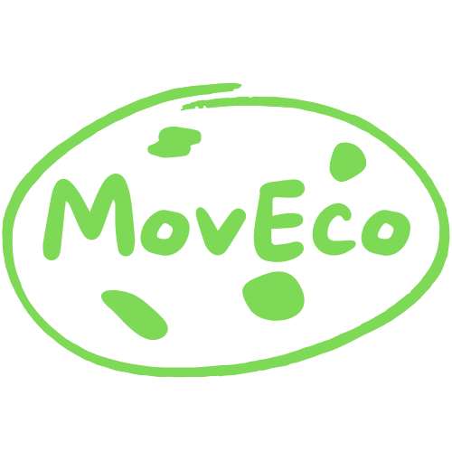

# MovEco(In progress) 

  

  

## Description  
Ce projet a pour but de mettre en avant le co-voiturage pour les trajets quotidien du domicile au travail et inversement afin d'aider a réduire:  
-La pollution atmosphérique ☁️  
-Le nombre de véhicule sur les routes(notamment aux heures de pointes) 😤  
et, on l'espère aussi, provoquer de belles rencontres 🫶🏽  
### Fonctionnalités:
Il permettra aux utilisateurs d'entrer leurs trajets réguliers et de trouver rapidement un autre utilisateur effectuant régulièrement le même trajet afin de pouvoir réserver une place. Les utilisateurs auront la possibilité d'ajouter dans un onglet "MovIzz", équivalent à "favoris", les personnes effectuant quotidiennement le même trajet afin d'avoir un accès plus rapide à ces personnes sans devoir passer de nouveau par la case "Recherche".
